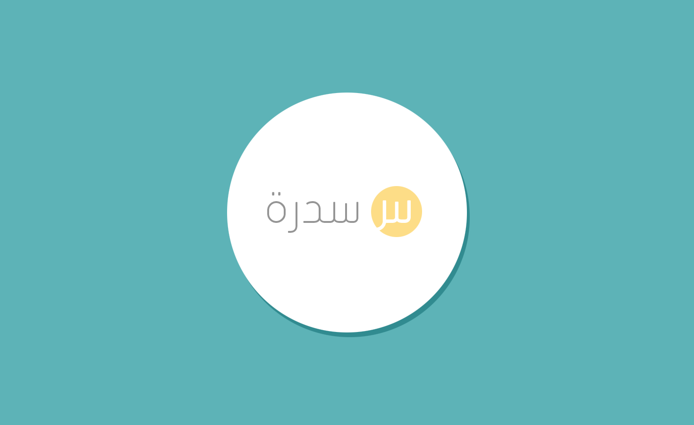

A family tree web application that has been created using PHP and uses MySQL as a database engine.

TODO:
=======
1. Change some names into global variables (or constants).
2. Make an installation file.
3. Disable logining from twitter.
4. Update the database functions to use PDO.
5. Design a better design, it is about Art, remember.
6. Validate inputs.
7. gitignore.
8. Consider removing classes folder.
9. Consider changing global.
10. Consider dealing with composer.
11. Consider removing un-necc. files.
12. Consider having the mobile field as a string started with the international code.
13. Consider running so many tests and security checks.
14. There are issues when redirecting in install.php.
16. Indian numbers has some issues.
17. Replace every family tree to sidrah.
18. Checking the MySQL encoding.
19. Remove addspecial... function from everything.

Requirements:
=======

- https://www.grc.com/passwords.htm
- https://mobily.ws
